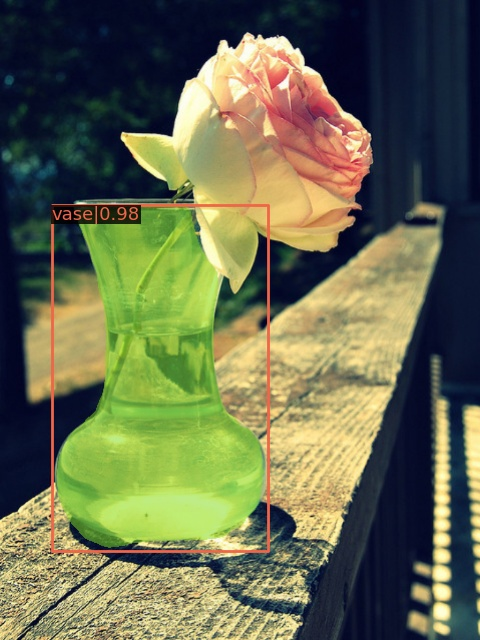
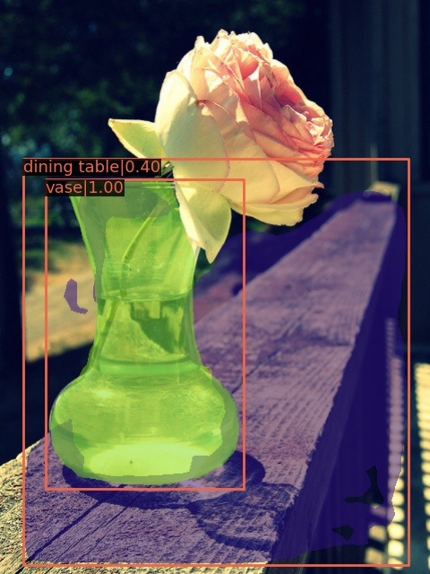
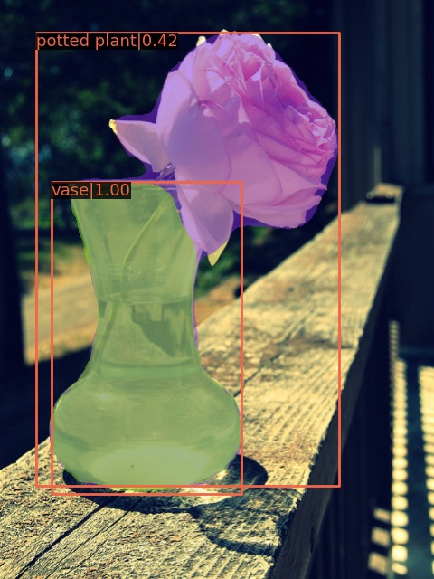

# LESA

## Introduction

This repository contains the official implementation of [Locally Enhanced Self-Attention: Combining Self-Attention and Convolution as Local and Context Terms](http://arxiv.org/abs/2107.05637).
The code for image classification and object detection is based on [axial-deeplab](https://github.com/csrhddlam/axial-deeplab) and [mmdetection](https://github.com/open-mmlab/mmdetection). 

<p align = "center">

</p>
<p align = "center">
Visualizing Locally Enhanced Self-Attention (LESA) at one spatial location. 
</p>

Image             |  Convolution | Self-Attention             |  LESA 
:-------------------------:|:-------------------------:|:-------------------------:|:-------------------------:
|||| 

<p align = "center">
Effectiveness  of  Locally  Enhanced  Self-Attention(LESA) on COCO object detection and instance segmentation. 
</p>


## Citing LESA

If you find LESA is helpful in your project, please consider citing our paper.

```BibTeX
@article{yang2021locally,
  title={Locally Enhanced Self-Attention: Rethinking Self-Attention as Local and Context Terms},
  author={Yang, Chenglin and Qiao, Siyuan and Kortylewski, Adam and Yuille, Alan},
  journal={arXiv preprint arXiv:2107.05637},
  year={2021}
}
```

## Main Results on ImageNet

Please refer to LESA_classification for details.

| Method    | Model | Top-1 Acc. | Top-5 Acc. |
|-----------|--------------|:------------:|:------------:|
| LESA_ResNet50 | [Download](https://livejohnshopkins-my.sharepoint.com/:f:/g/personal/cyang76_jh_edu/EnO2WCZcRwJJh1YsdHEZXOMBueC6q0baT4kWl_sI5SqjFQ?e=Wh9uWt) | 79.55 | 94.79 |
| LESA_WRN50 | [Download](https://livejohnshopkins-my.sharepoint.com/:f:/g/personal/cyang76_jh_edu/EgHuW1XQefNNkLCkRE1Ag4UBA96d7lBasZ4esEh3Re1mXA?e=jU72GG) | 80.18 | 95.07 |

## Main Results on COCO test-dev

Please refer to LESA_detection for details.

| Method    | Backbone          | Pretrained | Model | Box AP | Mask AP |
|:-----------:|:-----------------:|--------------|--------------|:------------:|:------------:|
| Mask-RCNN | LESA_ResNet50         | [Download](https://livejohnshopkins-my.sharepoint.com/:f:/g/personal/cyang76_jh_edu/EsV_fGZY-uhEkciwVckp4c8BlInA1GFv7gett1_LOZ0vFg?e=g1If75) | [Download](https://livejohnshopkins-my.sharepoint.com/:f:/g/personal/cyang76_jh_edu/Egpo87VmMmlEg0jY_KHYAJsBS7EFDJ4YxJ2zhkTxcJCzWg?e=SGSKmx) | 44.2 | 39.6 |
| HTC | LESA_WRN50 | [Download](https://livejohnshopkins-my.sharepoint.com/:f:/g/personal/cyang76_jh_edu/ElagAKEgXttArEbtVR6NpmEBWAZN0pNE5Q6MMXEJZ27VHg?e=dIdwAI) | [Download](https://livejohnshopkins-my.sharepoint.com/:f:/g/personal/cyang76_jh_edu/EmSPz8ToSK5GuYyWELj3Y0QBwP3Q_Jd4FhK1WDvf2FuADw?e=xRsbl5) | 50.5 | 44.4 |

## Credits

This project is based on [axial-deeplab](https://github.com/csrhddlam/axial-deeplab) and [mmdetection](https://github.com/open-mmlab/mmdetection).

Relative position embedding is based on [bottleneck-transformer-pytorch](https://github.com/lucidrains/bottleneck-transformer-pytorch/blob/main/bottleneck_transformer_pytorch/bottleneck_transformer_pytorch.py)

ResNet is based on [pytorch/vision](https://github.com/pytorch/vision/blob/master/torchvision/models/resnet.py). Classification helper functions are based on [pytorch-classification](https://github.com/bearpaw/pytorch-classification).
